   
Saya bikin aplikasi dan sistem otomatis yang beneran dipakai orang.

   
  

▸ SELECT MENU
PLAYER  ·  STATS  ·  STAGES  ·  QUESTS  ·  HIGH SCORE

▸ PLAYER 1 SELECT
<table> <tr> <td width="55%" valign="top">
Pelajar MAN 3 Banyumas angkatan 2023. Hobi saya mengurai kode-kode kompleks untuk menciptakan karya inovatif.

Ketika tidak menyusun algoritma, saya mengekspresikan kreativitas lewat seni penyuntingan.

</td> <td width="45%" valign="top">
VITAL	VALUE
CLASS	CODE-SMITH / EDITOR
BASE	Banyumas, Jawa Tengah
GUILD	MAN 3 Banyumas '23
TIMEZONE	WIB (UTC+7)
SINCE	2023
</td> </tr> </table> 
 
<b>▸ PIXO SAYS &nbsp;— klik buat buka</b>
  
  ╔══════════════════════════════════════════════╗
  ║  ██  ██     HALO! AKU PIXO ✦                 ║
  ║  ██  ██     "GRATIFY ITU BUATAN TAN!"        ║
  ║    ████     "MUSIK 8-BIT MEMBUAT HATI SENANG"║
  ║   ██████    "KAMU SUDAH MINUM AIR HARI INI?" ║
  ║  ██    ██   "JANGAN PENCET TOMBOL MERAH."    ║
  ║             "...SERIUS. JANGAN."             ║
  ╚══════════════════════════════════════════════╝
Konami code: ↑ ↑ ↓ ↓ ← → ← → B A

▸ STAT SCREEN

  
 
 <b>TIER</b> &nbsp; LEGENDARY ▸ EPIC ▸ RARE ▸ COMMON &nbsp;—&nbsp; peringkat dibaca dari panjang bar, bukan angka 

▸ STAGE SELECT
Empat kabinet. Klik buat buka.

 
<b>&nbsp;01 &nbsp;· &nbsp;GRATIFY</b> &nbsp;&nbsp;<code>DIFF ★★★★★</code> &nbsp;&nbsp;<i>Mobile / Web App · 2024 — sekarang</i>
  
Client YouTube Music untuk Android & Desktop, dengan sistem update dan notifikasi sendiri. Selain pemutarnya, saya bangun infrastruktur pendukungnya: manifest update yang dibaca aplikasi saat start, feed notifikasi in-app yang bisa dikirim tanpa rilis versi baru, dan halaman distribusi APK-nya sendiri.

Layar	Isi
PLAYER	Streaming tanpa iklan, kontrol background, antrian, playback jalan terus saat layar mati
KOLEKSI	Lagu disukai, playlist, unduhan, riwayat — satu daftar yang bisa diurutkan & diganti ke grid
LIRIK	Lirik tersinkron per baris: baris yang dinyanyikan menyala, sisanya meredup
BERANDA	Filter suasana (Santai / Tidur / Energik / Sedih) menyaring seluruh beranda
Show Image Show Image Show Image Show Image Show Image

▸ LIHAT & UNDUH

 
 
<b>&nbsp;02 &nbsp;· &nbsp;AUTOMENFES</b> &nbsp;&nbsp;<code>DIFF ★★★★☆</code> &nbsp;&nbsp;<i>Automated Platform / Bot · 2024 — sekarang</i>
  
Platform menfes anonim otomatis: pesan masuk lewat form, dilewatkan ke pipeline moderasi dan antrian, lalu tayang otomatis ke channel tujuan lewat webhook. Identitas pengirim tidak pernah ikut ke output — yang tersimpan hanya token antrian.

flowchart LR
    A["SUBMIT identitas dibuang"] --> B["SANITIZE strip HTML, normalisasi"]
    B --> C["MODERATE filter, spam score, rate limit"]
    C --> D["QUEUE token acak, bukan ID"]
    D --> E["WEBHOOK kirim ke channel"]
    E --> F["DELIVERED tayang"]

    classDef s fill:#241546,stroke:#b99bff,color:#f5f0ff,stroke-width:2px;
    classDef ok fill:#1a3d38,stroke:#7fffe0,color:#7fffe0,stroke-width:2px;
    class A,B,C,D,E s;
    class F ok;
Show Image Show Image Show Image Show Image Show Image

 
 
<b>&nbsp;03 &nbsp;· &nbsp;KALEIDOSKOP</b> &nbsp;&nbsp;<code>DIFF ★★★☆☆</code> &nbsp;&nbsp;<i>Editing / Motion · 2024</i>
  
Kaleidoskop tahunan MAN 3 Banyumas — rangkuman satu tahun jadi satu tayangan, dikerjakan sebagai Ketua Divisi Editing Jurnalistik. Transisi dan tipografi kinetik di After Effects; potongan disusun mengikuti tempo musik supaya enak diikuti.

Show Image Show Image

▸ TONTON DI YOUTUBE

 
 
<b>&nbsp;04 &nbsp;· &nbsp;PARTY X-F</b> &nbsp;&nbsp;<code>DIFF ★★☆☆☆</code> &nbsp;&nbsp;<i>Editing / Visual · 2024</i>
  
Rangkaian materi visual dan editing untuk acara kelas X-F — poster, bumper pembuka, dan overlay dengan tipografi tebal dan warna kontras.

Show Image

▸ QUEST LOG
timeline
    title QUEST LOG — TanDjendra
    2023 : Masuk MAN 3 Banyumas
         : Mulai Web Designer di CFO
    2024 : Ketua Divisi Editing Jurnalistik
         : Kaleidoskop + Party X-F
         : Rilis Gratify & Automenfes
    2025 : Gratify Android + Desktop, OTA update
    2026 : Cyber Arcade portfolio
PERIOD	ROLE	GUILD
2023 — 2024	Web Designer	CFO — landing page, copywriting produk & jasa, customer service WhatsApp, web development
2023 — 2024	Ketua Divisi Editing	Jurnalistik MAN 3 Banyumas — memimpin divisi editing untuk publikasi & dokumentasi sekolah
▸ SYSTEM STATS

      

▸ HIGH SCORE

RANK	TAG	CHANNEL	PLAYER	SCORE
🥇 1ST	GIT	GITHUB	TanDjendra	999999
🥈 2ND	IGM	INSTAGRAM	@calestaan	874500
🥉 3RD	TIK	TIKTOK	@samuelltann	651200
4TH	LNK	LINKEDIN	Tan Heradhe	540800
5TH	DSC	DISCORD	TannIndomie	432100
6TH	EML	EMAIL	tandjendra11@gmail.com	398600
 
    

╔═══════════════════════════════════════════════════════════╗
║                                                           ║
║        G A M E   O V E R  ?     INSERT COIN ▸ 01          ║
║                                                           ║
║              CONTINUE?   10 . 9 . 8 . 7 ...               ║
║                                                           ║
╚═══════════════════════════════════════════════════════════╝
Dibuat oleh <b>Tan Heradhe Rat Djendra</b> — Banyumas, Jawa Tengah

